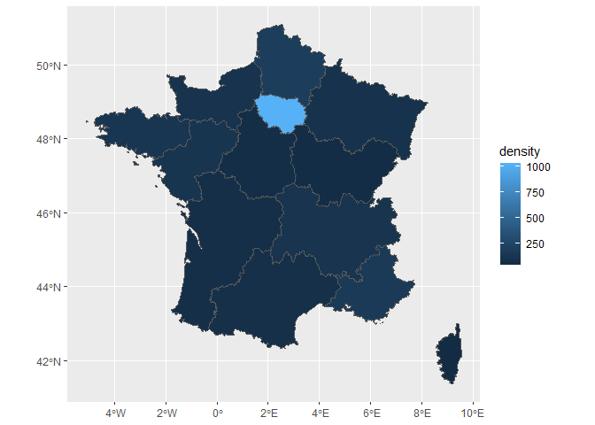

how-to-use-this-package
================

Several datasets are already included in the package and may be used
directly.

We will start with the population density of the French regions.

``` r

head(france_regions)
#> Simple feature collection with 6 features and 2 fields
#> Geometry type: GEOMETRY
#> Dimension:     XY
#> Bounding box:  xmin: -5.103601 ymin: 41.36705 xmax: 9.559721 ymax: 50.16073
#> Geodetic CRS:  WGS 84
#>                       nom   density                       geometry
#> 1    Auvergne-Rhône-Alpes 115.88188 POLYGON ((4.780213 46.17668...
#> 2 Bourgogne-Franche-Comté  58.15100 POLYGON ((3.629424 46.74946...
#> 3                Bretagne 125.20448 MULTIPOLYGON (((-3.659144 4...
#> 4     Centre-Val de Loire  65.21896 POLYGON ((2.874625 47.52042...
#> 5                   Corse  40.39509 POLYGON ((9.402268 41.8587,...
#> 6               Grand Est  96.65120 POLYGON ((4.233164 49.95775...
```

``` r

ggplot(france_regions, aes(fill=density))+
  geom_sf()
```

<!-- -->
