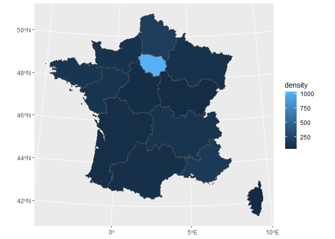
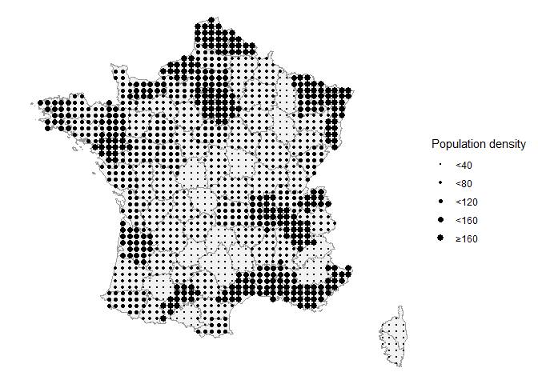

{bertin} package vignette
================

The main goal of this package is to easily transform choropleth maps
into valued points in the way of Jacques Bertin.


# 1. Package installation

The package may be downloaded from GitHub. It may also be downloaded
directly from R with the following command:

``` r
# Installation directly with R (to use only once):
# devtools::install_github("BjnNowak/bertin")

# Once installed, you may load it into your R session
library(bertin)

# Two other packages will be useful to process the data: {tidyverse} and {sf}
library(tidyverse)
library(sf)
```

# 2. Converting polygons vector files to points vector files

Several datasets are already included in the package and may be used
directly.

We will start with the population density of the French regions.

``` r
head(france_regions)
#> Simple feature collection with 6 features and 2 fields
#> Geometry type: GEOMETRY
#> Dimension:     XY
#> Bounding box:  xmin: -5.103601 ymin: 41.36705 xmax: 9.559721 ymax: 50.16073
#> Geodetic CRS:  WGS 84
#>                       nom   density                       geometry
#> 1    Auvergne-Rhône-Alpes 115.88188 POLYGON ((4.780213 46.17668...
#> 2 Bourgogne-Franche-Comté  58.15100 POLYGON ((3.629424 46.74946...
#> 3                Bretagne 125.20448 MULTIPOLYGON (((-3.659144 4...
#> 4     Centre-Val de Loire  65.21896 POLYGON ((2.874625 47.52042...
#> 5                   Corse  40.39509 POLYGON ((9.402268 41.8587,...
#> 6               Grand Est  96.65120 POLYGON ((4.233164 49.95775...
```

A choropleth map of the population density can be easily created from
this file:

``` r
ggplot(france_regions, aes(fill=density))+
  geom_sf()+
  coord_sf(crs='EPSG:2154') # CRS for France
```

<!-- -->

With {bertin}, it only takes one function (**make_points()**) to convert
this choropleth map to a point valued map.

``` r
regions_valued <- make_points(
  polygon=france_regions, # Input file (sf object)
  n=45, # Number of points per side
  square=TRUE # Points shaped as squares (hexagons otherwise)
)

ggplot(regions_valued,aes(size=density))+
  # Keep French regions borders as background
  geom_sf(
    france_regions,
    mapping=aes(geometry=geometry),
    inherit.aes=FALSE
  )+
  geom_sf()+
  scale_size(range=c(1,3))+
  coord_sf(crs='EPSG:2154')
```

<!-- -->

In the previous example, the high population density of the Paris region
overwhelms the differences between the other regions. In addition, the
spatial scale is coarser than that of the original map by Jacques
Bertin.

We will now try to reproduce this map with the departmental scale
dataset, also available in the package.

``` r
departments_valued<-make_points(
  polygon=france_departments,
  n=55,
  square=TRUE
  )%>%
  mutate(density_cl=case_when(
    density<40~40,
    density<80~80,
    density<120~120,
    density<160~160,
    TRUE~161
  ))

ggplot(departments_valued,aes(size=as.factor(density_cl)))+
  # French departments as background
  geom_sf(
    france_departments,
    mapping=aes(geometry=geometry),
    fill="grey95",color="grey60",
    inherit.aes=FALSE
  )+
  geom_sf()+
  scale_size_manual(
    values=seq(0.5,3,0.5),
    labels=c("<40","<80","<120","<160","≥160"))+
  labs(size="Population density")+
  coord_sf(crs='EPSG:2154')+
  theme_void()
```

<!-- -->

Besides these examples for France, the make_points() function can be
applied to any sf polygon object, with a valid crs.

# 3. Converting raster files to points vector files

In addition to Jacques Bertin’s original application (transforming
polygon vectors into points), the package also lets you do the same
thing with rasters.

To illustrate this, we can load the raster representing the state of
vegetation in France for the summer of 2021.

This raster can be loaded by copying/pasting the URL in the R code
below, or by downloading it at the [following
link](https://github.com/BjnNowak/TidyTuesday/raw/main/map/ndvi/france/median_NDVI_France_Ju_to_Se_2020.tif).

``` r
library(terra) # library to work with rasters

# Load raster based on URL
rst<-rast('https://github.com/BjnNowak/TidyTuesday/raw/main/map/ndvi/france/median_NDVI_France_Ju_to_Se_2020.tif')

# Plot raster
ggplot()+
  tidyterra::geom_spatraster(
    data=rst%>%filter(NDVI>0),
    aes(fill = NDVI),
    na.rm=TRUE,mask=TRUE,
    maxcell = 50e+05
  )
```

<!-- -->

The raster can now be converted into points using the
**make_points_rst()** function in the {bertin} package.

The input raster must be a {terra} object, the output vector is a {sf}
object.

``` r
vec_agg<-make_points_rst(
  rst=rst, # raster file (as terra object)
  n=40 # number of points per side
)

# Make plot
ggplot()+
  geom_sf(
    france_departments,mapping=aes(geometry=geometry),
    color=alpha("white",0),fill="grey90")+
  geom_sf(vec_agg,mapping=aes(size=NDVI,geometry=geometry))+
  scale_size_binned(range=c(0.1,3.5),limits=c(0.3,0.9))+
  theme_void()
```

<!-- -->

# Examples of plots made with {bertin}

**Using make_points()** *Farm animals density in France based on
departemental statistics from Agreste (a tribute to the original human
population density map from Bertin)*

Link to
[code](https://github.com/BjnNowak/TidyTuesday/blob/main/SC_farm_animals.R)
<br><br> **Using make_points_rst()** *Evolution of vegetation cover in
Europe from MODIS Normalized Difference Vegetation Index (NDVI) rasters*

Link to
[code](https://github.com/BjnNowak/TidyTuesday/blob/main/SC_GreenCountry_Europe.R)
